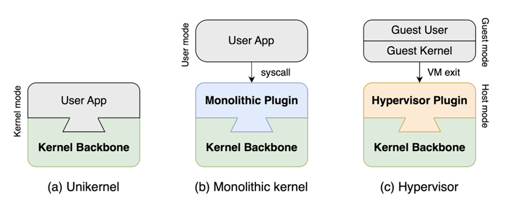
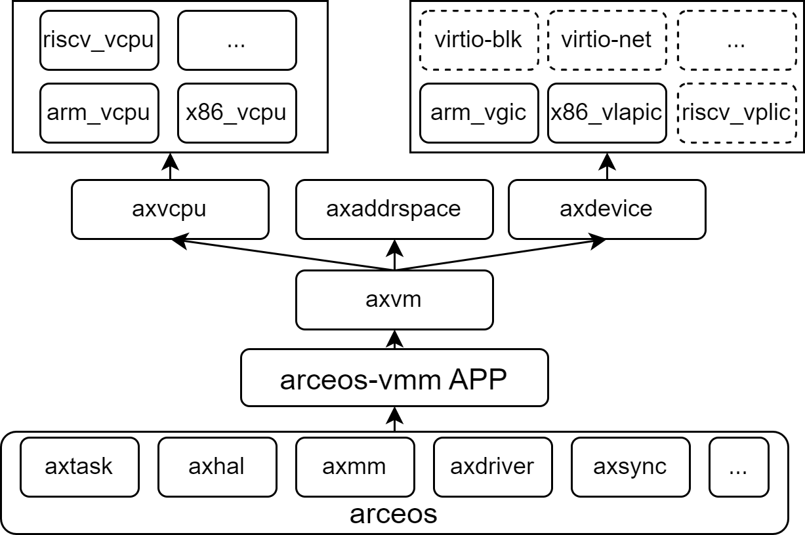
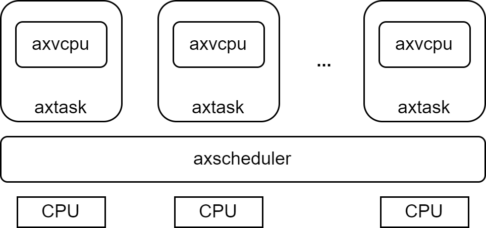
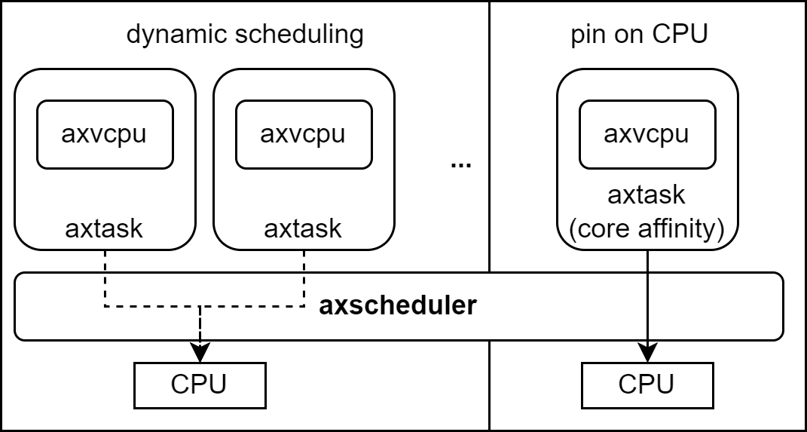
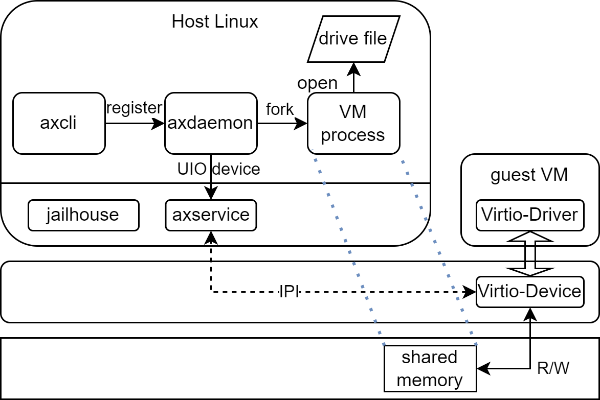

# 基于 ArceOS 的统一模块化 Hypervisor 设计文档

> 我们是不是应该把 `axvisor` 的名字正式端上来了？现在的命名确实有些混乱。

## 1. 设计目标

ArceOS-Hypervisor 是基于 ArceOS unikernel 框架实现的 Hypervisor。其目标是利用 ArceOS 提供的基础操作系统功能作为基础，实现一个统一的模块化 Hypervisor。统一指使用同一套代码同时支持 x86_64、arm(aarch64) 和 RISC-V 三种架构，以最大化复用架构无关代码，简化代码开发和维护成本。模块化指 Hypervisor 的功能被分解为多个模块，每个模块实现一个特定的功能，模块之间通过标准接口进行通信，以实现功能的解耦和复用。

ArceOS 是一个基于 Rust 语言的 unikernel 框架，其设计目标是提供一个高性能、模块化、最小化的操作系统基座。通过在 ArceOS 的基础上添加不同的模块，就可以对应不同的应用场景生成不同的操作系统：在 ArceOS 上直接添加应用程序，就可以生成一个独立的应用程序 unikernel 镜像；在 ArceOS 上添加宏内核模块，就可以生成一个完整的宏内核操作系统；ArceOS-Hypervisor 则在 ArceOS 的基础上添加虚拟化相关模块，从而以最小成本实现一个 Type-1 Hypervisor。

## 2. 软件架构

ArceOS-Hypervisor 的软件架构如下图所示，图中每一个框都是一个独立的模块，模块之间通过标准接口进行通信。包括作为基础的 ArceOS 在内，ArceOS-Hypervisor 的软件架构分为五层：

### 2.1. ArceOS

在 ArceOS-Hypervisor 中，ArceOS 作为最底层的基础存在，提供内存管理、任务调度、设备驱动、同步原语等多种基础功能。ArceOS 的模块化设计允许 ArceOS-Hypervisor 灵活选择需要的模块，这不仅缩减了编译的开销和二进制体积，也提高了系统的安全性和可靠性。

### 2.2. ArceOS-VMM 应用程序（App）

ArceOS-VMM 应用程序是整个 ArceOS-Hypervisor 的核心，它作为 ArceOS 上的一个 unikernel 应用程序运行。ArceOS-VMM 应用程序负责管理虚拟机的生命周期，进行创建、销毁、启动、停止等操作，维护虚拟机的配置、状态、资源等信息，同时也负责处理虚拟机之间的隔离与通信，以及虚拟机对硬件资源的申请和访问。

### 2.3. `axvm` 模块

`axvm` 模块位于 ArceOS-Hypervisor 的中间层，它定义了虚拟机的数据结构和操作接口，具体实现了虚拟机的创建、销毁、启动、停止等功能。同时，`axvm` 模块还负责虚拟机内部虚拟 CPU 的创建、销毁、启动、停止等功能，并负责管理虚拟内存、虚拟设备等资源，实现虚拟环境内操作系统和应用程序对各种虚拟资源的访问。

### 2.4. `axvcpu`、`axaddrspace` 和 `axdevice` 模块

在 `axvm` 模块的下层是 `axvcpu`、`axaddrspace` 和 `axdevice` 三个具体实现的模块，`axvcpu` 模块负责架构无关虚拟 CPU 的具体实现，`axaddrspace` 模块负责虚拟内存的具体实现，`axdevice` 模块负责虚拟设备的具体实现。这三个模块共同构成了虚拟机的基础设施，为虚拟机提供了 CPU、内存、设备等基本资源。

`axvcpu` 模块定义了虚拟 CPU 的数据结构和统一操作接口。尽管各个架构下的虚拟化技术千差万别，但是通过统一的接口，架构之间的差异在 `axvcpu` 模块中得到了屏蔽，从而允许 `axvm` 及以上层的模块不受架构的限制，实现架构无关的虚拟机管理，提高了代码的复用性和可移植性。

`axaddrspace` 模块定义了虚拟内存特别是嵌套页表的数据结构。通过复用 ArceOS 的页表等数据结构，实现了架构无关的虚拟内存管理。

`axdevice` 模块定义了虚拟设备统一访问接口，提供了虚拟设备的基本抽象和封装，允许虚拟机通过统一的接口访问不同的虚拟设备，从而实现虚拟机对硬件资源的访问。

### 2.5. 具体实现模块

基于 `axvcpu` 和 `axdevice` 模块，ArceOS-Hypervisor 实现了不同架构下的具体虚拟 CPU 和虚拟设备模块，虚拟 CPU 包括 `x86_vcpu`、`arm_vcpu` 和 `riscv_vcpu`，虚拟设备包括 `x86_vlapic`、`arm_gic` 以及正在实现的 `virtio_blk`、`virtio_net` 等等。这些模块实现了具体的虚拟化功能，并且通过 `axvcpu` 和 `axdevice` 模块提供的统一接口与其它模块进行交互，这使得代码的复用性和可移植性得到了极大的提高。

### 2.6. axvisor_api？

是否需要把 `axvisor_api` 提出来。好处可以写潜在与 ArceOS 解耦，提高可移植性的可能性。另外可以随便说说。

## 3. 运行流程

### 3.1. 虚拟 CPU 调度

ArceOS-Hypervisor 的执行流程如下图所示：

【似乎可以补一张图？】

执行流程的核心是虚拟 CPU 的调度。在 ArceOS-Hypervisor 中，虚拟 CPU 是虚拟机的基本执行单元，每个虚拟机可以包含一个或多个虚拟 CPU。虚拟 CPU 的调度是通过复用 ArceOS 的任务调度机制实现的，每个虚拟 CPU 作为一个任务，由 ArceOS 的任务调度器进行调度：

ArceOS-Hypervisor 还支持混合的调度策略。对于不同的虚拟 CPU，可以采用不同的调度策略，例如，对于实时任务，可以将对应的虚拟 CPU 固定在一个物理 CPU 上，独占物理 CPU 的资源，以保证实时任务的响应时间；对于普通任务，则通过调度器进行动态调度，以实现资源的高效利用：

### 3.2. VMExit 处理

### 3.3. 影子进程

影子进程是一种通过将具体设备直通给虚拟机内的 Linux 等成品操作系统，让其他虚拟机通过虚拟机间通信和共享内存等方式与这个 Linux 进行通信，从而实现……的技术：

